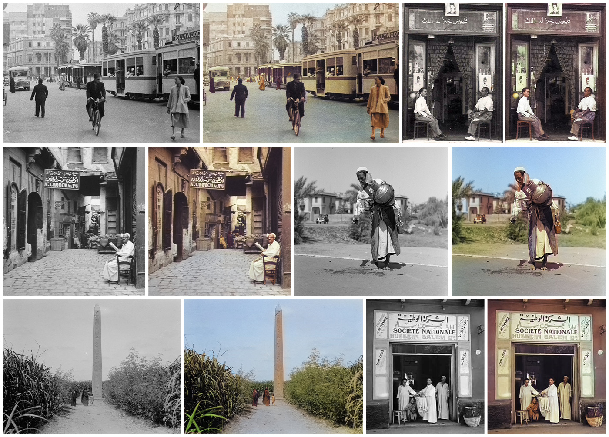
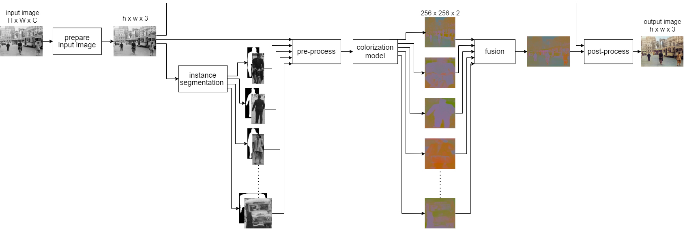
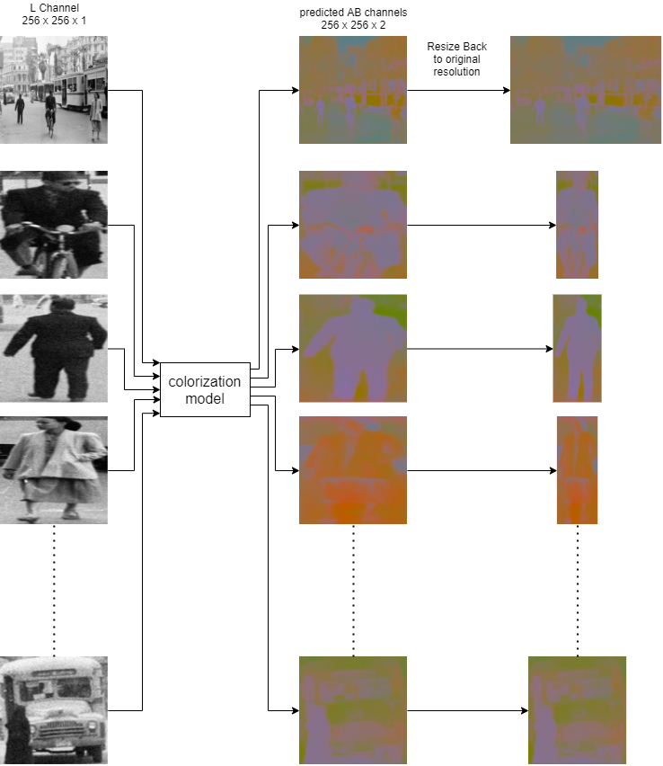
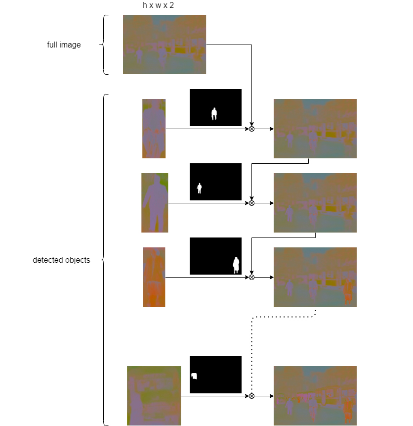
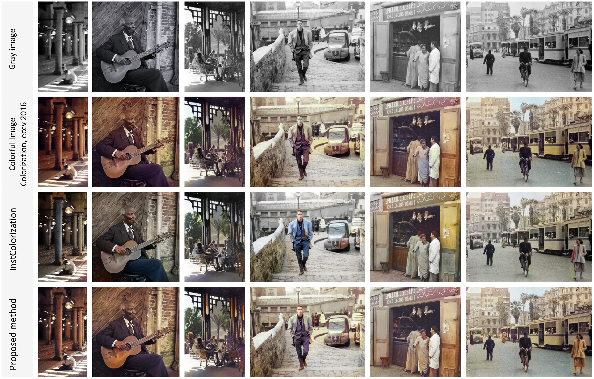

# Patch Colorization



Colorizing a grayscale image is an ambiguous task since there are two lost dimensions out of three, keeping one dimension carries only the illumination intensity that could not be transformed in any direct way to represent the actual colors of the image. On this project a fully automated method is provided to perform colorization for old black and white images. This method tries to solve the problem of washed-out colors and color bleeding issues resulting from current colorization methods. The proposed method relies on detecting objects from the image and colorizing the whole image that is used as a base color then colorizing each detected object separately and replace objects colors on the full image with objects colors that is colorized separately, this approach provides a high resolution and better colorization that represents the colors of the objects more accurately.

## Method Architecture

Overall method architecture is shown on the figure below.



### 1. Prepare input image

Image is resized if the larger dimension of the image is larger than a predefined value, also on this step the input image is set to has 3 channels in RGB color space if it consists only of one channel (grayscale color space).

### 2. Instance segmentation

Detectron2 by Facebook is used for instance segmentation module to detect as many objects as we can from the prepared input image and produce cropped object images alongside with their masks.

### 3. Pre-process

Prepared input image and detected instances are converted to LAB color space then extract from it the L channel with the shape 256x256x1 that will be passed to the colorization model.

### 4. Colorization

The colorization module is a CNN that maps a grayscale input image to a distribution over quantized color value, it takes the extracted L channel with shape 256x256x1 and outputs two associated channels AB that contains the colors data with shape 256x256x2.



### 5. Fusion

Colors data of the objects on the full image is replaced with the resulting colors from colorizing each object on its own, masks of the detected objects are used to determine the object pixels on the full image.



### 6. Post-process

After replacing all objects colors data on the AB channels of the full image, the original L channel of the input image is stacked with the resulting AB channels and then converted from LAB colorspace to RGB, after that an automatic saturation adjustment is applied to the final image.

## Results

The colorization results below shows a comparison against [Colorful Image Colorization ECCV 2016](http://richzhang.github.io/colorization/) and [InstColorization](https://github.com/ericsujw/InstColorization).



## Getting Started

### 1. clone repository

```
git clone https://github.com/moziada/PatchColorization.git
```

### 2. install dependencies

* numpy
* PIL
* torch
* skimage
* opencv-python
* matplotlib
* [detectron2](https://detectron2.readthedocs.io/en/latest/tutorials/install.html)

### 3. Download models

* [colorization model](https://colorizers.s3.us-east-2.amazonaws.com/colorization_release_v2-9b330a0b.pth)
* [instance segmentation model](https://dl.fbaipublicfiles.com/detectron2/COCO-InstanceSegmentation/mask_rcnn_R_101_FPN_3x/138205316/model_final_a3ec72.pkl)

and place them in `models` directory.

## Image colorization

1. Put the desired image in `examples` directory.
2. Set `imgName` variable with the name of the image in `colorize_image.py` file.
3. Run `colorize_image.py` file.
4. Check the output result in `output` directory.

## Folder colorization

1. Put the desired images in `examples` directory.
2. Run `colorize_folder.py` file.
3. Check the output results on `output` directory.

## Acknowledgments

The colorization module uses [Colorful Image Colorization](http://richzhang.github.io/colorization/) model by Zhang et al.
The overall method idea is inspired by [InstColorization](https://github.com/ericsujw/InstColorization) repository.
Instance segmentation module uses [Detectron2](https://github.com/facebookresearch/Detectron/) framework with [R101-FPN](https://github.com/facebookresearch/detectron2/blob/master/MODEL_ZOO.md) COCO instance segmentation baseline.
